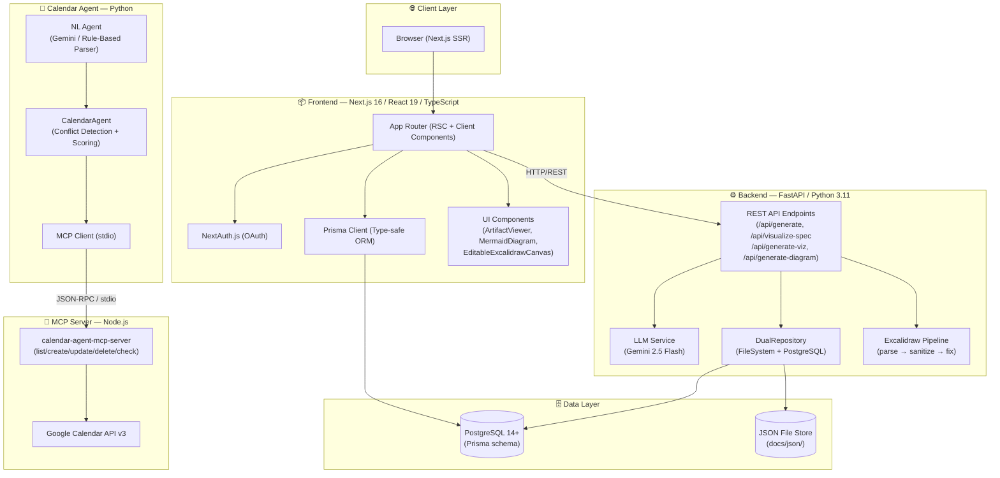
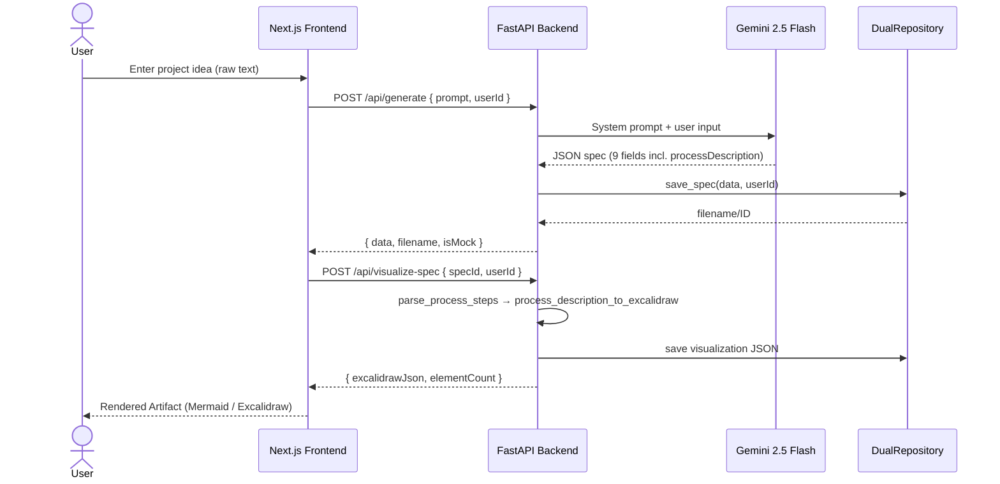
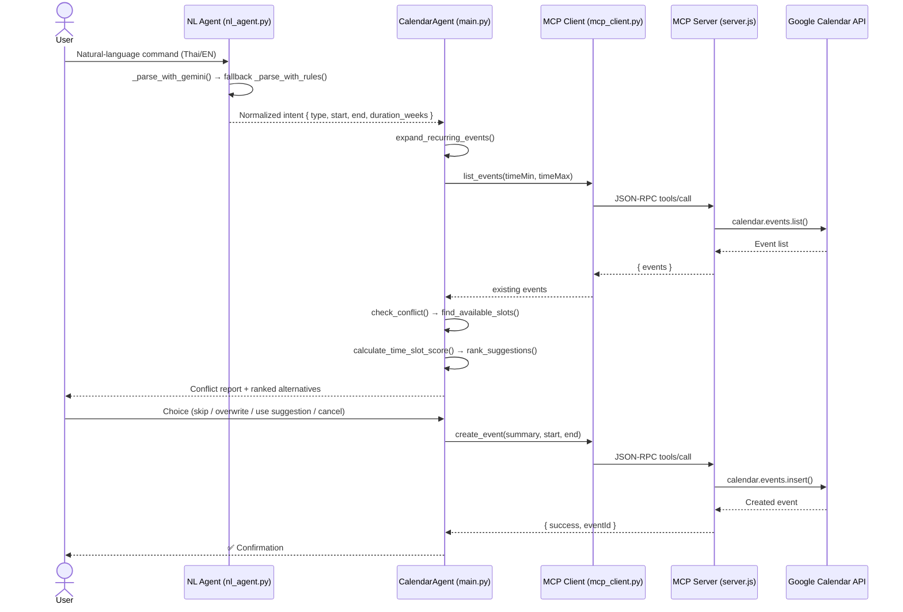
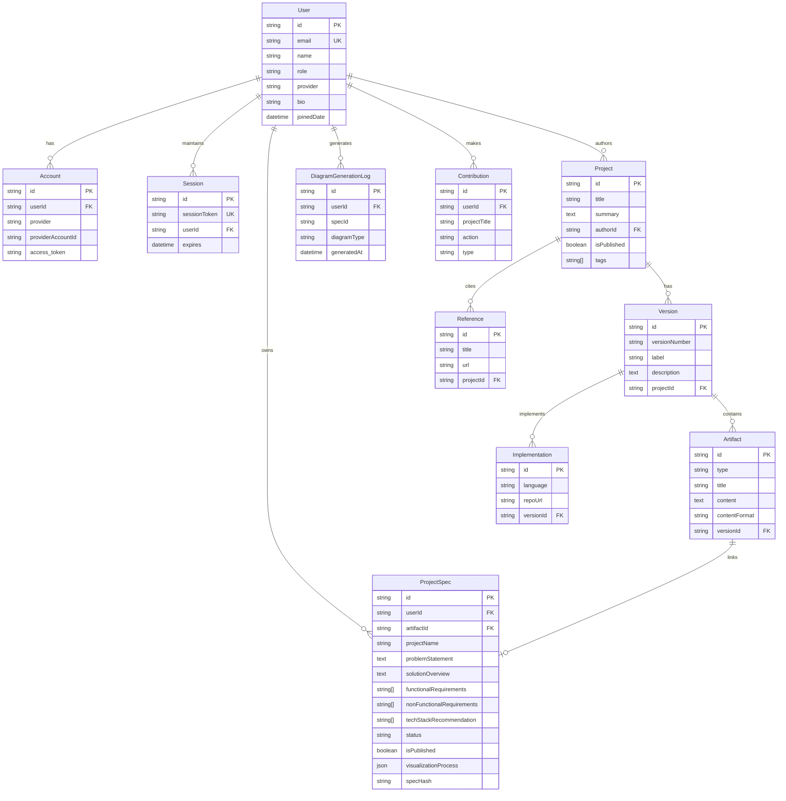
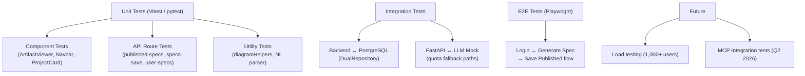
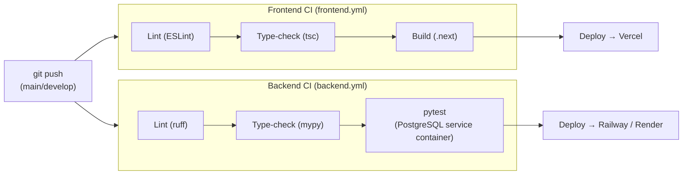

# Blueprint Hub — AI-Powered Requirements & Architecture Management


> **A polyglot, AI-native monorepo** that combines a **software requirements management SaaS platform** (Blueprint Hub) with an **agentic Google Calendar integration system** — built as an academic R&D sandbox for exploring agentic software architecture.

---

## Table of Contents

1. [Planning](#1-planning)
2. [Analysis](#2-analysis)
3. [Design](#3-design)
4. [Implementation](#4-implementation)
5. [Testing](#5-testing)
6. [Deployment](#6-deployment)
7. [Maintenance](#7-maintenance)
8. [Quick Start](#quick-start)

---

## 1. Planning

### 1.1 Problem Statement

Software architects and product teams lack a **centralized, AI-assisted platform** for:

- Creating and managing software specifications (requirements, architecture artifacts)
- Intelligently scheduling recurring academic/professional calendar events with conflict resolution
- Generating visual diagrams (Excalidraw, Mermaid) programmatically from natural-language descriptions

Manual spec creation consumes **40%+ of engineering time**, while calendar scheduling remains context-unaware and error-prone.

### 1.2 Solution Overview

**Blueprint Hub** delivers two integrated subsystems:

| Subsystem | Description |
|-----------|-------------|
| **Blueprint Hub Web Platform** | Next.js SaaS for AI-powered spec generation, version tracking, and collaborative artifact management |
| **Google Calendar MCP Agent** | Python agentic system with NL parsing, conflict detection, smart slot scoring, and MCP-based Google Calendar integration |

### 1.3 Technology Rationale

| Decision | Rationale |
|----------|-----------|
| **Bun** over npm/yarn | Faster install & test execution for the Next.js frontend |
| **uv** over pip/poetry | Faster Python dependency resolution for the FastAPI backend |
| **Next.js App Router** | Server Components enable BFF pattern without a separate API gateway |
| **FastAPI** | Async-first, type-safe Python API with auto-generated OpenAPI docs |
| **Prisma ORM** | Schema-as-code, type-safe DB access, migration management |
| **MCP (Model Context Protocol)** | Standardized tool-use protocol enabling LLM agents to call external APIs |
| **Google Gemini 2.5 Flash** | Primary LLM for spec generation & NL intent parsing with quota fallback |

---

## 2. Analysis

### 2.1 Functional Requirements (Implemented — MVP)

| ID | Requirement | Status |
|----|-------------|--------|
| FR-001 | User authentication via Google & GitHub OAuth (NextAuth.js) | ✅ |
| FR-002 | Blueprint CRUD with 9 standard requirement sections | ✅ |
| FR-003 | AI-powered spec generation via Gemini 2.5 Flash | ✅ |
| FR-004 | Rich artifact support: Text, Markdown, Mermaid diagrams, Excalidraw | ✅ |
| FR-005 | Version tracking (V0.1 → V1.0 → V2.0) | ✅ |
| FR-006 | Publish & share blueprints (isPublished flag) | ✅ |
| FR-007 | AI visualization: Excalidraw process-flow diagrams | ✅ |
| FR-008 | Natural-language calendar event creation (Thai & English) | ✅ |
| FR-009 | Recurring event expansion with conflict detection | ✅ |
| FR-010 | Smart time-slot scoring & alternative suggestions | ✅ |
| FR-011 | Google Calendar MCP server (list/create/update/delete/check) | ✅ |

### 2.2 Planned Features (Q2–Q3 2026)

- FR-101: Database MCP for context-aware spec generation
- FR-102: GitHub MCP for blueprint ↔ issue sync
- FR-103: Draw.io MCP for architecture diagrams
- FR-104: Real-time collaborative editing
- FR-105: Export to PDF/DOCX/HTML

### 2.3 Non-Functional Requirements

| Attribute | Target |
|-----------|--------|
| Spec generation latency | < 8 s (p90) |
| Page load time | < 2 s |
| API response time | < 200 ms (p90) |
| Concurrent users | 1,000+ |
| Uptime | ≥ 99.5% |
| Test coverage | ≥ 50% lines (frontend), ≥ 80% target |
| Auth | OAuth 2.0 (Google, GitHub) |
| Security | Rate limiting, CORS, input validation, HTTPS/TLS |

### 2.4 Key Stakeholders

| Role | Interaction |
|------|-------------|
| **Software Architects** | Create & manage architecture documents |
| **Product Managers** | Define requirements, approve blueprints |
| **Development Teams** | Consume specifications for implementation |
| **QA Engineers** | Derive test cases from requirement artifacts |
| **CS Students / R&D** | Explore agentic architectures (primary author's role) |

---

## 3. Design

### 3.1 System Architecture

The repository is organized as a **Monorepo** with three independently deployable service layers:



### 3.2 Data Flow — Spec Generation Pipeline



### 3.3 Calendar Agent Data Flow



### 3.4 Entity–Relationship Diagram



### 3.5 Design Patterns

| Pattern | Location | Purpose |
|---------|----------|---------|
| **Repository Pattern** | `backend/db.py` — `SpecRepository`, `FileSystemRepository`, `PostgreSQLRepository`, `DualRepository` | Abstracts storage backend; supports dual-write with graceful degradation |
| **Abstract Factory / Strategy** | `backend/api.py` — `generate_process_diagram(mcp_type)` | Selects Excalidraw / Draw.io / Figma pipeline at runtime |
| **Template Method** | `backend/db.py` — `SpecRepository` ABC | Defines spec CRUD contract; subclasses provide implementations |
| **Dependency Injection** | `python/main.py` — `CalendarAgent(calendar_tool)` | Decouples agent logic from calendar backend (mock ↔ real MCP) |
| **Facade** | `python/mcp_client.py` | Simplifies JSON-RPC MCP protocol calls behind a clean Python API |
| **Chain of Responsibility** | `python/nl_agent.py` — Gemini → rule-based → error | NL parsing falls through providers gracefully |
| **Composite** | `backend/db.py` — `DualRepository` | Aggregates FileSystem + PostgreSQL repos into unified interface |
| **BFF (Backend-for-Frontend)** | `frontend/app/api/` — Next.js API Routes | Thin API layer between React client and FastAPI service |

### 3.6 Architectural Styles

- **Monorepo** — `frontend/`, `backend/`, `python/` as co-located, independently deployable services
- **Layered Architecture** — Presentation → Application → Domain → Infrastructure per service
- **Agentic / Tool-Use Architecture** — Calendar Agent uses MCP (Model Context Protocol) for structured LLM tool calls
- **Dual-Write Storage** — `DualRepository` writes to both JSON file-store and PostgreSQL for resilience

---

## 4. Implementation

### 4.1 Repository Structure

```
google-calendar-mcp/
├── .github/
│   ├── workflows/
│   │   ├── frontend.yml       # Lint → Type-check → Build
│   │   └── backend.yml        # Lint (ruff) → Type-check (mypy) → pytest
│   └── copilot-instructions.md
│
├── frontend/                  # Next.js 16 + React 19 + TypeScript
│   ├── app/                   # App Router (RSC + API routes)
│   │   ├── api/               # BFF API routes (specs, generate, auth)
│   │   ├── generator-test/    # Spec generation UI
│   │   ├── excalidraw-test/   # Diagram canvas UI
│   │   ├── profile/           # User profile
│   │   └── project/           # Project detail views
│   ├── components/            # Reusable React components
│   │   ├── ArtifactViewer.tsx
│   │   ├── MermaidDiagram.tsx
│   │   ├── EditableExcalidrawCanvas.tsx
│   │   ├── ProcessDiagramViewer.tsx
│   │   └── CreateRequest.tsx
│   ├── prisma/
│   │   ├── schema.prisma      # DB schema (SSOT)
│   │   └── seed.ts
│   ├── lib/                   # Shared utilities
│   ├── types/                 # TypeScript type definitions
│   └── tests/                 # Playwright E2E tests
│
├── backend/                   # Python FastAPI + LLM integration
│   ├── api.py                 # FastAPI app + all endpoints
│   ├── db.py                  # Repository pattern (Dual/FS/PG)
│   ├── config.py              # Rate limits, storage, MCP config
│   ├── llm_to_excalidraw.py   # Process description → Excalidraw JSON
│   ├── excalidraw_utils.py    # sanitize_elements / fix_elements
│   ├── gemini_to_excalidraw.py
│   └── tests/                 # pytest test suite
│
├── python/                    # Calendar Agent system
│   ├── main.py                # CalendarAgent core (conflict/scoring)
│   ├── nl_agent.py            # NL intent parser (Gemini + rule-based)
│   ├── mcp_client.py          # MCP protocol client
│   ├── calendar_integrations.py  # Google Calendar API direct integration
│   ├── app.py                 # Flask/FastAPI web interface
│   ├── execute_nl.py          # CLI entrypoint for NL commands
│   ├── mcp-server/
│   │   └── server.js          # Node.js MCP server (Google Calendar)
│   └── tests/
│
└── docs/                      # 30+ documentation files
    ├── diagrams/              # Architecture, data-flow, user-journey
    ├── session-notes/         # ADRs and architectural decisions
    └── API_CONTRACTS.md
```

### 4.2 Core Modules

#### Backend API (`backend/api.py`)

| Endpoint | Method | Description |
|----------|--------|-------------|
| `/api/health` | GET | DB connectivity check |
| `/api/generate` | POST | LLM spec generation (Gemini 2.5 Flash) with mock fallback |
| `/api/specs` | GET / POST | List all specs / Save spec |
| `/api/specs/{id}` | DELETE | Delete a spec |
| `/api/generate-viz` | POST | Process description → Excalidraw JSON |
| `/api/generate-diagram` | POST | Process description → Mermaid flowchart |
| `/api/visualize-spec` | POST | Full pipeline: fetch spec → generate diagram → save |

#### AI-Native Components

- **Quota-Aware LLM Fallback** — All LLM calls detect `429 / quota_exhausted` and return deterministic mock outputs, ensuring the UI workflow never breaks
- **`DualRepository`** — Composite write strategy; PostgreSQL primary, JSON file-store fallback
- **NL Intent Parser** (`nl_agent.py`) — Gemini-first with regex rule-based fallback supporting Thai and English date formats
- **CalendarAgent Scoring** (`main.py`) — `calculate_time_slot_score()` ranks alternative slots 0–100 based on time-of-day preferences, lunch avoidance, and proximity to ideal start time
- **MCP Server** (`python/mcp-server/server.js`) — Implements `list_events`, `create_event`, `update_event`, `delete_event`, `check_availability` over JSON-RPC stdio transport

---

## 5. Testing

### 5.1 Coverage Summary

| Layer | Framework | Tests | Coverage |
|-------|-----------|-------|----------|
| Frontend Unit | Vitest + Testing Library | 44 passing | 74.3% lines |
| API Routes | Vitest | 25 passing | 100% core routes |
| Backend | pytest | 20 passing | ~35% overall |
| E2E | Playwright | 1/1 critical path | generate + save verified |

Configured thresholds (CI fails if not met): Lines/Statements ≥ 50%, Functions/Branches ≥ 20%.

### 5.2 Test Commands

```bash
# Frontend unit tests
cd frontend && bun run test:unit

# Frontend E2E tests
cd frontend && bun run test:e2e

# Backend tests
cd backend && uv run pytest

# Backend with coverage
cd backend && uv run pytest --cov=. --cov-report=html
```

### 5.3 Test Strategy



---

## 6. Deployment

### 6.1 CI/CD Pipeline



### 6.2 Environments

| Environment | Frontend | Backend | Database |
|-------------|----------|---------|----------|
| **Local Dev** | `localhost:3000` (Bun) | `localhost:8000` (uvicorn) | PostgreSQL local |
| **Production (Planned)** | Vercel (Edge) | Railway / Render | Supabase / Railway PG |

### 6.3 Prerequisites

- **Bun** ≥ 1.x — [bun.sh](https://bun.sh)
- **uv** ≥ 0.4 — [docs.astral.sh/uv](https://docs.astral.sh/uv)
- **Node.js** ≥ 18 (for MCP server)
- **Python** ≥ 3.11
- **PostgreSQL** ≥ 14

### 6.4 Docker

```bash
# Backend (FastAPI + PostgreSQL)
cd backend && docker-compose up -d

# Python Calendar Agent
cd python && docker-compose up -d
```

---

## Quick Start

### 1. Clone & Install

```bash
git clone https://github.com/your-org/google-calendar-mcp.git
cd google-calendar-mcp

# Frontend
cd frontend && bun install && cd ..

# Backend
cd backend && uv sync && cd ..

# Calendar Agent
cd python && pip install -r requirements.txt && cd ..

# MCP Server
cd python/mcp-server && npm install && cd ../..
```

### 2. Configure Environment

```bash
# Frontend
cp frontend/.env.example frontend/.env
# Set: DATABASE_URL, NEXTAUTH_SECRET, GOOGLE_CLIENT_ID/SECRET, GITHUB_CLIENT_ID/SECRET

# Backend
cp backend/.env.example backend/.env
# Set: GEMINI_API_KEY, DB_HOST, DB_USER, DB_PASSWORD, DB_NAME

# Calendar Agent
cp python/.env.example python/.env
# Set: GEMINI_API_KEY, GOOGLE_CLIENT_ID/SECRET, CALENDAR_ID
```

### 3. Database Setup

```bash
cd frontend
bunx prisma migrate deploy
bunx prisma db seed
```

### 4. Run All Services

```bash
# Terminal 1 — Frontend
cd frontend && bun run dev          # http://localhost:3000

# Terminal 2 — Backend API
cd backend && uv run python app.py  # http://localhost:8000

# Terminal 3 — MCP Server (optional)
cd python/mcp-server && node server.js

# Terminal 4 — Calendar Agent CLI
cd python && python execute_nl.py "ลงตาราง CS301 ทุกวันจันทร์ 9:30-12:30 เป็นเวลา 18 สัปดาห์"
```

---

## 7. Maintenance

### 7.1 Scalability Roadmap

| Phase | Target | Strategy |
|-------|--------|----------|
| **Now (MVP)** | < 100 users | Single-instance, DualRepository |
| **Q2 2026** | 100–500 users | Redis caching, CDN for static assets |
| **Q3 2026** | 1,000+ users | Horizontal scaling (stateless FastAPI), DB read replicas |
| **Beyond** | 10,000+ users | Event-driven with message queue (planned) |

### 7.2 Monitoring (Planned)

- **Metrics**: Grafana + Prometheus
- **Error Tracking**: Sentry
- **Logs**: Structured JSON logging (uvicorn + Next.js)
- **Alerts**: Real-time on API p95 > 500ms, error rate > 1%

### 7.3 Future Enhancements

| Feature | Priority | Target |
|---------|----------|--------|
| Database MCP (context-aware generation) | 🔴 High | Q2 2026 |
| GitHub MCP (blueprint ↔ issue sync) | 🔴 High | Q2 2026 |
| Excalidraw MCP (visual diagram editor) | 🟡 Medium | Q2 2026 |
| Real-time collaborative editing | 🟡 Medium | Q3 2026 |
| Export to PDF/DOCX/HTML | 🟡 Medium | Q3 2026 |
| User Manual (40+ pages) | 🟢 Low | Q3 2026 |
| Production security audit | 🔴 High | Q3 2026 |

### 7.4 Known Technical Debt

- Gemini API quota handling is mock-only in development; Redis-backed rate limiting is planned
- `DualRepository.list_all_specs()` performs in-memory merge; should be unified DB query at scale
- MCP server uses OAuth2 token file — production should use service account or secret manager

---

## Documentation Index

| Document | Purpose |
|----------|---------|
| [SDLC.md](SDLC.md) | Complete SDLC documentation (PRD, BRD, SRS, SAD) |
| [docs/API_CONTRACTS.md](docs/API_CONTRACTS.md) | API endpoint specification |
| [docs/DATABASE_SETUP.md](docs/DATABASE_SETUP.md) | PostgreSQL & Prisma setup guide |
| [docs/TESTING_STRATEGY.md](docs/TESTING_STRATEGY.md) | Full testing plan |
| [docs/DEPLOYMENT_GUIDE.md](docs/DEPLOYMENT_GUIDE.md) | Deployment & ops guide |
| [docs/ONBOARDING.md](docs/ONBOARDING.md) | Developer onboarding checklist |
| [docs/FEATURE_ROADMAP.md](docs/FEATURE_ROADMAP.md) | Feature milestones |
| [GOOGLE_OAUTH_SETUP.md](GOOGLE_OAUTH_SETUP.md) | Google OAuth & Calendar credentials |
| [python/README.md](python/README.md) | Calendar Agent detailed guide |
| [CONTRIBUTING.md](CONTRIBUTING.md) | Contribution guidelines |
| [SECURITY.md](SECURITY.md) | Security policy & checklist |

---

## Tech Stack

| Layer | Technology | Package Manager |
|-------|-----------|----------------|
| Frontend | Next.js 16 + React 19 + TypeScript + Tailwind CSS 4 | Bun |
| Auth | NextAuth.js v5 (OAuth 2.0) | Bun |
| ORM | Prisma 7 + `@prisma/adapter-pg` | Bun |
| Database | PostgreSQL 14+ | — |
| Backend API | Python 3.11 + FastAPI | uv |
| LLM | Google Gemini 2.5 Flash / 2.0 Flash | — |
| Diagrams | Mermaid.js 11 + Excalidraw 0.18 | CDN / Bun |
| Calendar MCP | Node.js 18 + `@modelcontextprotocol/sdk` + googleapis | npm |
| CI/CD | GitHub Actions | — |
| Container | Docker + docker-compose | — |

---

## Contributing

1. Read [CONTRIBUTING.md](CONTRIBUTING.md) and [CODE_OF_CONDUCT.md](CODE_OF_CONDUCT.md)
2. Fork & branch: `git checkout -b feature/your-feature`
3. Follow conventions: [TypeScript](docs/TypeScript_conventions.md) | [Python](docs/Python_conventions.md)
4. Run: `bun run lint && bun run build` (frontend), `uv run ruff check . && uv run pytest` (backend)
5. Open PR using the [PR template](.github/PULL_REQUEST_TEMPLATE.md)

---

## License

MIT — See [LICENSE](LICENSE) for details.

---

**Version**: 0.1.0 (Prototype MVP) | **Last Updated**: April 2026 | **Author**: CS Student R&D Project
