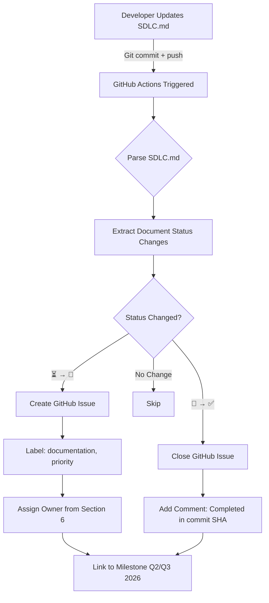

# SDLC Documentation Analysis & Action Plan

**Date:** March 2, 2026  
**Purpose:** Analysis of SDLC.md gaps, industry standards compliance, and team rollout strategy  
**Owner:** Tech Lead + Documentation Team

---

## 1. Document Gaps Analysis (⏳ Planned Items)

### 1.1 Current Status Summary

| Phase | Complete | Partial | Planned | Total | Completion % |
|-------|----------|---------|---------|-------|--------------|
| Planning | 4 | 0 | 0 | 4 | 100% ✅ |
| Requirements | 4 | 0 | 0 | 4 | 100% ✅ |
| Design | 5 | 1 | 0 | 6 | 92% ✅ |
| Implementation | 4 | 0 | 0 | 4 | 100% ✅ |
| Testing | 1 | 0 | 3 | 4 | 25% ⚠️ |
| Deployment | 0 | 0 | 4 | 4 | 0% ⏳ |
| Maintenance | 1 | 0 | 3 | 4 | 25% ⏳ |
| **TOTAL** | **19** | **1** | **10** | **30** | **67%** |

### 1.2 Gap Details by Priority

#### 🔴 HIGH PRIORITY (Q2 2026 - Must Have)

**1. Test Plan (Testing Phase)**
- **Status:** ⏳ Planned
- **Why Critical:** Required for Q2 2026 MCP implementation testing
- **Dependencies:** Testing Strategy ✅ (already exists)
- **Effort:** 2-3 days
- **Owner:** QA Lead
- **Acceptance Criteria:**
  - Test objectives aligned with TESTING_STRATEGY.md
  - Test schedule for MCP integrations (Database, Prompts, Excalidraw, GitHub)
  - Resource allocation (QA Engineers, Dev support)
  - Entry/Exit criteria defined
- **Linked Issues:** MCP Issues #1-8
- **Business Impact:** Blocks Q2 2026 MCP launches without proper testing coverage

**2. Deployment Guide (Deployment Phase)**
- **Status:** ⏳ Planned
- **Why Critical:** Production launch Q3 2026 requires deployment procedures
- **Dependencies:** Testing complete, Infrastructure ready
- **Effort:** 3-4 days
- **Owner:** DevOps Engineer
- **Acceptance Criteria:**
  - Step-by-step deployment for Railway/Vercel
  - Environment-specific configurations (dev, staging, prod)
  - Rollback procedures documented
  - Security checklist integrated
- **Linked Issues:** None yet (should create)
- **Business Impact:** Production launch risk without documented deployment process

**3. Operations Guide / Runbook (Maintenance Phase)**
- **Status:** ⏳ Planned
- **Why Critical:** Production support requires operational procedures
- **Dependencies:** Deployment complete, Monitoring setup
- **Effort:** 4-5 days
- **Owner:** DevOps Engineer + Support Team
- **Acceptance Criteria:**
  - Incident response procedures
  - Monitoring & alerting setup (Grafana, Prometheus)
  - Common issues troubleshooting
  - Performance tuning guidelines
- **Linked Issues:** None yet
- **Business Impact:** Production incidents unresolved without operational playbook

#### 🟡 MEDIUM PRIORITY (Q3 2026 - Should Have)

**4. Test Cases (Testing Phase)**
- **Status:** ⏳ Planned
- **Why Important:** Comprehensive test coverage for quality assurance
- **Dependencies:** Test Plan ✅ (high priority item #1)
- **Effort:** 5-7 days (ongoing)
- **Owner:** QA Engineer
- **Acceptance Criteria:**
  - Test cases for all FR-001 to FR-108
  - Regression test suite
  - Edge cases documented
  - Test data fixtures
- **Linked Issues:** Testing backlog
- **Business Impact:** Quality issues slip to production without comprehensive test cases

**5. Release Notes (Deployment Phase)**
- **Status:** ⏳ Planned
- **Why Important:** Communication for stakeholders and users
- **Dependencies:** Version tracking (✅ implemented)
- **Effort:** 1-2 days per release
- **Owner:** Product Manager
- **Acceptance Criteria:**
  - New features documented
  - Bug fixes listed
  - Breaking changes highlighted
  - Migration guides (if needed)
- **Linked Issues:** None yet
- **Business Impact:** Poor user experience without clear release communication

**6. User Manual (Maintenance Phase)**
- **Status:** ⏳ Planned
- **Why Important:** User adoption and satisfaction
- **Dependencies:** UI/UX finalized, Features complete
- **Effort:** 7-10 days
- **Owner:** Technical Writer
- **Acceptance Criteria:**
  - Getting started guide
  - Feature walkthroughs
  - Best practices
  - FAQs
- **Linked Issues:** None yet
- **Business Impact:** Low user adoption without clear documentation

#### 🟢 LOW PRIORITY (Q4 2026 - Nice to Have)

**7. Test Reports (Testing Phase)**
- **Status:** ⏳ Planned
- **Why Useful:** Historical test data and quality metrics
- **Dependencies:** Test execution complete
- **Effort:** 2-3 days (template + automation)
- **Owner:** QA Engineer
- **Acceptance Criteria:**
  - Test execution summary
  - Defect metrics
  - Coverage reports
  - Trend analysis
- **Linked Issues:** None yet
- **Business Impact:** Quality insights limited but not blocking

**8. Configuration Management (Deployment Phase)**
- **Status:** ⏳ Planned
- **Why Useful:** Environment consistency and security
- **Dependencies:** Deployment process defined
- **Effort:** 3-4 days
- **Owner:** DevOps Engineer
- **Acceptance Criteria:**
  - Environment variables documented
  - Secrets management (e.g., Vault, AWS Secrets Manager)
  - Configuration versioning
  - Audit trail
- **Linked Issues:** None yet
- **Business Impact:** Configuration drift risk but mitigated by Infrastructure as Code

**9. Support Documentation (Maintenance Phase)**
- **Status:** ⏳ Planned
- **Why Useful:** Support team efficiency
- **Dependencies:** User Manual complete, Common issues identified
- **Effort:** 5-7 days
- **Owner:** Support Team Lead
- **Acceptance Criteria:**
  - Tier 1/2/3 support escalation
  - Known issues & workarounds
  - Support ticket templates
  - SLA definitions
- **Linked Issues:** None yet
- **Business Impact:** Support efficiency but team can use User Manual initially

**10. Low-Level Design (LLD) - Design Phase**
- **Status:** ⚠️ Partial (component-level details not fully documented)
- **Why Useful:** Detailed implementation guidance
- **Dependencies:** HLD complete ✅, Implementation ongoing
- **Effort:** 3-5 days
- **Owner:** Lead Developer
- **Acceptance Criteria:**
  - Class diagrams for core components
  - Algorithm descriptions
  - Data structure specifications
  - Code-level design patterns
- **Linked Issues:** None yet
- **Business Impact:** Developers use code as documentation currently

---

## 2. Industry Standards Compliance Analysis

### 2.1 IEEE 830-1998 (Software Requirements Specification)

**Current SDLC.md Coverage:**

| IEEE 830 Section | SDLC.md Equivalent | Status | Notes |
|------------------|-------------------|--------|-------|
| **1. Introduction** | Section 1 (Project Overview) | ✅ Complete | Problem statement, scope, stakeholders |
| **2. Overall Description** | Section 1.2 (Solution) | ✅ Complete | Product perspective, user classes |
| **3. Specific Requirements** | Section 3 (Requirements) | ✅ Complete | FR-001 to FR-108, NFRs with metrics |
| **3.1 External Interfaces** | Section 4.2 (Architecture) | ✅ Complete | API interfaces, UI, database |
| **3.2 Functional Requirements** | Section 3.1 | ✅ Complete | Detailed functional requirements |
| **3.3 Performance Requirements** | Section 3.2 | ✅ Complete | <8s generation, <2s page load |
| **3.4 Design Constraints** | Section 4.3 (Design Patterns) | ✅ Complete | Clean Architecture, tech stack |
| **3.5 Software System Attributes** | Section 3.2 | ✅ Complete | Security, reliability, maintainability |
| **Appendices** | Section 11 (References) | ✅ Complete | Links to diagrams, docs |

**Compliance Score:** 95% ✅

**Gaps:**
- ⚠️ Missing: Formal use case format (Preconditions, Postconditions, Main Flow, Alternative Flow)
  - **Recommendation:** Add use case templates in Section 7.3 (SRS Explained)
  - **Priority:** Low (examples exist but not formally structured)

**Strengths:**
- ✅ Comprehensive functional requirements with unique IDs (FR-001 to FR-108)
- ✅ Quantified non-functional requirements (metrics-based)
- ✅ Clear traceability with cross-references

---

### 2.2 ISO/IEC/IEEE 29119 (Software Testing)

**Current SDLC.md Coverage:**

| ISO 29119 Section | SDLC.md Equivalent | Status | Notes |
|-------------------|-------------------|--------|-------|
| **Part 1: Concepts & Definitions** | Section 6 (SDLC Mapping) | ✅ Complete | Testing phase mapped |
| **Part 2: Test Processes** | docs/TESTING_STRATEGY.md | ✅ Complete | 15 sections, SDLC compliant |
| **Part 3: Test Documentation** | Test Plan ⏳, Test Cases ⏳ | ⚠️ Partial | Strategy exists, Plan/Cases planned |
| **Part 4: Test Techniques** | TESTING_STRATEGY.md Section 3 | ✅ Complete | Unit, integration, E2E, regression |
| **Test Policy** | TESTING_STRATEGY.md Section 2 | ✅ Complete | Objectives, quality goals |
| **Test Strategy** | TESTING_STRATEGY.md | ✅ Complete | Comprehensive 600+ lines |
| **Test Plan** | ⏳ Planned Q2 2026 | ❌ Missing | HIGH PRIORITY GAP |
| **Test Cases** | ⏳ Planned Q2 2026 | ❌ Missing | MEDIUM PRIORITY GAP |
| **Test Reports** | ⏳ Planned Q4 2026 | ❌ Missing | LOW PRIORITY GAP |

**Compliance Score:** 70% ⚠️

**Gaps:**
- ❌ **Critical:** Test Plan document missing (HIGH PRIORITY)
- ❌ **Important:** Test Cases repository missing (MEDIUM PRIORITY)
- ❌ **Useful:** Test Reports template missing (LOW PRIORITY)

**Recommendations:**
1. **Q2 2026 (High Priority):** Create Test Plan based on TESTING_STRATEGY.md
   - Test objectives per MCP integration
   - Test schedule aligned with Q2 milestones
   - Resource allocation and training needs
   
2. **Q2 2026 (Medium Priority):** Create Test Cases template and initial suite
   - Use Jest for unit tests (frontend/backend)
   - Cypress/Playwright for E2E tests
   - Security test cases (OWASP Top 10)

3. **Q4 2026 (Low Priority):** Implement automated test reporting
   - CI/CD integration (Jest coverage, Cypress dashboard)
   - Quality metrics dashboard (Grafana)

**Strengths:**
- ✅ Comprehensive TESTING_STRATEGY.md (SDLC standard)
- ✅ Clear test types defined (functional, performance, security, usability)
- ✅ Tools selected (Jest, pytest, Cypress, Playwright)

---

### 2.3 IEEE 1471-2000 (Software Architecture Documentation)

**Current SDLC.md Coverage:**

| IEEE 1471 Section | SDLC.md Equivalent | Status | Notes |
|-------------------|-------------------|--------|-------|
| **Architecture Description** | Section 4 (Architecture & Tech Stack) | ✅ Complete | Tech stack, patterns |
| **Stakeholders & Concerns** | Section 2 (Stakeholders) | ✅ Complete | 6 user types, team, external |
| **Viewpoints** | docs/diagrams/ | ✅ Complete | 30+ diagrams (5 categories) |
| **Logical View** | docs/diagrams/architecture.md | ✅ Complete | System components |
| **Process View** | docs/diagrams/data-flow.md | ✅ Complete | Sequences, data flows |
| **Development View** | docs/diagrams/deployment.md | ✅ Complete | Infrastructure |
| **Physical View** | docs/diagrams/deployment.md | ✅ Complete | Dev, staging, production |
| **Scenarios (Use Cases)** | docs/diagrams/user-journey.md | ✅ Complete | 7 user journeys |
| **Rationale** | Section 4.3 (Design Patterns) | ✅ Complete | Patterns explained |

**Compliance Score:** 98% ✅

**Gaps:**
- ⚠️ Missing: Explicit architecture decision records (ADRs)
  - **Recommendation:** Link to session-notes/ as living ADRs
  - **Priority:** Low (session notes serve this purpose)

**Strengths:**
- ✅ Multiple viewpoints (30+ diagrams across 5 categories)
- ✅ Stakeholder-driven architecture concerns
- ✅ Design rationale documented (patterns, tradeoffs)

---

### 2.4 Overall Standards Compliance Summary

| Standard | Compliance Score | Status | Priority Gaps |
|----------|-----------------|--------|--------------|
| **IEEE 830** (Requirements) | 95% | ✅ Excellent | Use case formal structure (Low) |
| **ISO 29119** (Testing) | 70% | ⚠️ Partial | Test Plan (High), Test Cases (Medium) |
| **IEEE 1471** (Architecture) | 98% | ✅ Excellent | ADR formalization (Low) |
| **Overall** | **88%** | ✅ **Good** | Focus on testing documentation |

**Key Recommendations:**
1. ✅ **Maintain Strengths:** Keep comprehensive requirements and architecture docs updated
2. 🔴 **Address Testing Gap:** Prioritize Test Plan creation (Q2 2026)
3. 🟡 **Optional Enhancements:** Formalize use cases, ADRs (Q3-Q4 2026)

---

## 3. Five-Step Team Rollout Plan for SDLC.md

### 3.1 Rollout Strategy Overview

**Objective:** Ensure all stakeholders can reference and contribute to SDLC.md effectively

**Timeline:** 2 weeks (March 3-14, 2026)

**Success Metrics:**
- 100% team awareness of SDLC.md location and purpose
- 80%+ team members have accessed SDLC.md at least once
- 5+ team members contribute updates within first month
- <5 min average lookup time for SDLC document references

---

### Step 1: Team Announcement & Kickoff (Day 1 - March 3, 2026)

**Duration:** 1 day  
**Owner:** Tech Lead + Product Manager

**Activities:**
1. **Announce SDLC.md in team channels:**
   ```
   📋 New SDLC Documentation Guide Live!
   
   We've created a comprehensive SDLC documentation guide to answer:
   "ต้องมี document อะไรบ้างในการทำ software product 1 ชิ้น?"
   
   📍 Location: [SDLC.md](link)
   
   What's inside:
   - 30+ document types mapped across 7 SDLC phases
   - PRD, BRD, SRS, SAD explained with Blueprint Hub examples
   - Document status dashboard (✅ Complete, ⏳ Planned)
   - Single Source of Truth (SSOT) locations
   
   🎯 Your Action:
   1. Bookmark SDLC.md (5 min)
   2. Read Section 6 (SDLC Mapping Table) - see your responsibilities
   3. Join kickoff call tomorrow 10 AM
   
   Questions? Reply here or DM @TechLead
   ```

2. **Schedule kickoff call** (30 min all-hands meeting)
   - Demo SDLC.md navigation
   - Show Quick Links in README.md → SDLC.md
   - Explain document ownership (Section 6 SDLC Mapping)
   - Q&A session

3. **Share "Quick Start" guide:**
   ```
   Quick Start with SDLC.md:
   1. Need requirements format? → Section 7.2 (PRD)
   2. Need architecture template? → Section 7.4 (SAD)
   3. Need document status? → Section 9 (Dashboard)
   4. Need to find existing docs? → Section 8 (SSOT)
   ```

**Deliverables:**
- ✅ Team announcement in Slack/Teams
- ✅ Kickoff meeting invite sent
- ✅ "Quick Start" guide shared

**Success Criteria:**
- 100% team acknowledged announcement
- 90%+ attendance at kickoff call

---

### Step 2: Role-Based Onboarding (Days 2-5 - March 4-7, 2026)

**Duration:** 4 days (1 day per team)  
**Owner:** Role leads (PM, Tech Lead, QA Lead, DevOps)

**Activities:**

**Day 2 - Product & Business Team:**
- **Focus:** Sections 1, 2, 7.1 (BRD), 7.2 (PRD)
- **Session Lead:** Product Manager
- **Content:**
  - How to write BRD and PRD using SDLC.md templates
  - Where to find stakeholder analysis (Section 2)
  - How to link features to SDLC phases
- **Hands-on Exercise:** Update Section 3.1 (FR-101 to FR-108 details)
- **Duration:** 1 hour workshop

**Day 3 - Engineering Team (Dev + QA):**
- **Focus:** Sections 3, 4, 7.3 (SRS), 7.4 (SAD)
- **Session Lead:** Tech Lead + QA Lead
- **Content:**
  - Technical requirements in Section 3
  - Architecture in Section 4
  - SRS and SAD explained
  - Testing documentation (link to TESTING_STRATEGY.md)
- **Hands-on Exercise:** Review architecture diagram references
- **Duration:** 1.5 hour workshop

**Day 4 - DevOps & Infrastructure Team:**
- **Focus:** Sections 4.4 (Deployment), 6 (Testing/Deployment/Maintenance phases)
- **Session Lead:** DevOps Lead
- **Content:**
  - Deployment architecture (Section 4.4)
  - Document gaps for DevOps (Deployment Guide ⏳, Runbook ⏳)
  - How to contribute to SDLC.md
- **Hands-on Exercise:** Draft Deployment Guide outline (HIGH PRIORITY)
- **Duration:** 1 hour workshop

**Day 5 - Everyone (Documentation & SSOT Training):**
- **Focus:** Sections 8 (SSOT), 9 (Dashboard), 10 (Next Steps)
- **Session Lead:** Tech Lead
- **Content:**
  - SSOT principle explained
  - Where to find any document (Section 8 table)
  - How to check document status (Section 9)
  - How to update SDLC.md (Git workflow)
- **Hands-on Exercise:** Find 3 documents using SSOT table
- **Duration:** 45 min workshop

**Deliverables:**
- ✅ 4 role-specific workshops completed
- ✅ Workshop recordings shared
- ✅ Hands-on exercises completed by 80%+ participants

**Success Criteria:**
- 80%+ team members attended relevant workshop
- <3 min average time to find document using SSOT table

---

### Step 3: Documentation Cleanup Sprint (Days 6-10 - March 8-12, 2026)

**Duration:** 5 days  
**Owner:** Individual document owners (per Section 6 SDLC Mapping)

**Activities:**

**Parallel Workstreams:**

1. **High Priority Docs (Days 6-10):**
   - **Test Plan** (QA Lead) - 3 days
   - **Deployment Guide** (DevOps Engineer) - 4 days
   - **LLD Updates** (Lead Developer) - 2 days
   - **Use Case Formalization** (System Analyst) - 2 days

2. **SDLC.md Accuracy Review (Days 6-7):**
   - Fix "Blueprint" vs "Project" terminology (Tech Lead)
   - Verify all cross-references work (Documentation Team)
   - Update version numbers if needed (Product Manager)

3. **Document Status Updates (Daily):**
   - Each document owner updates Section 9 (Dashboard) daily
   - Change status: ⏳ → 🚧 (in progress) → ✅ (complete)

**Daily Standup (15 min):**
- What document you worked on yesterday
- What document you'll work on today
- Any blockers (missing information, unclear requirements)

**Deliverables:**
- ✅ Test Plan document created (HIGH PRIORITY)
- ✅ Deployment Guide document created (HIGH PRIORITY)
- ✅ SDLC.md accuracy reviewed and fixed
- ✅ Section 9 (Dashboard) updated daily

**Success Criteria:**
- Test Plan and Deployment Guide complete
- SDLC.md 100% accurate
- Zero broken cross-references

---

### Step 4: Feedback Collection & Iteration (Days 11-13 - March 11-13, 2026)

**Duration:** 3 days  
**Owner:** Tech Lead + Product Manager

**Activities:**

**Day 11 - Survey Distribution:**
- Send survey to all team members:
  ```
  SDLC.md Feedback Survey (5 min)
  
  1. How often have you referenced SDLC.md this week?
     - Never / 1-2 times / 3-5 times / 6+ times
  
  2. How easy was it to find documents using SDLC.md?
     - Very difficult / Difficult / Easy / Very easy
  
  3. Which section was most helpful to you?
     - (Dropdown: Section 1-11)
  
  4. Which document gap should we prioritize next?
     - (Dropdown: Test Cases, Release Notes, User Manual, etc.)
  
  5. What would improve SDLC.md usability?
     - (Open text)
  ```

**Day 12 - Feedback Analysis:**
- Aggregate survey results
- Identify common pain points
- Prioritize improvement suggestions
- Create action items for iterations

**Day 13 - Implement Quick Wins:**
- Fix high-priority feedback items (same day)
- Examples:
  - Add FAQ section if confusion about terminology
  - Add more cross-references if navigation unclear
  - Expand examples if templates insufficient
- Schedule follow-up for complex improvements (Q2 backlog)

**Deliverables:**
- ✅ Feedback survey distributed
- ✅ Survey results analyzed
- ✅ Quick wins implemented
- ✅ Improvement backlog created

**Success Criteria:**
- 80%+ survey response rate
- 70%+ "Easy" or "Very easy" for document findability
- 5+ actionable improvements identified

---

### Step 5: Continuous Improvement Setup (Day 14 - March 14, 2026)

**Duration:** 1 day  
**Owner:** Tech Lead

**Activities:**

1. **Establish Documentation Review Cadence:**
   - **Weekly:** Document status updates (Section 9)
   - **Bi-weekly:** Review document gaps and prioritize next document
   - **Monthly:** SDLC.md accuracy review (verify cross-references, update metrics)
   - **Quarterly:** Full SDLC process review (align with project milestones)

2. **Assign SDLC.md Maintainers:**
   - **Primary Maintainer:** Tech Lead (overall accuracy)
   - **Section Owners:** Per Section 6 SDLC Mapping table
   - **Backup Maintainer:** Product Manager (business sections)

3. **Set Up Automation (Optional - Future Enhancement):**
   - **Auto-sync GitHub issues** (Task 8 - see Section 4 below)
   - **Document status dashboard** (Grafana visualization)
   - **Broken link checker** (CI/CD integration)

4. **Create Contribution Guidelines for SDLC.md:**
   ```markdown
   ## How to Update SDLC.md
   
   1. **Before editing:**
      - Check if your change affects other sections
      - Verify cross-references still work
      - Update "Last Updated" date
   
   2. **What to update:**
      - Section 9 (Dashboard): Change status when document completed
      - Section 6 (Mapping): Add new document types discovered
      - Section 8 (SSOT): Update locations when files move
   
   3. **Commit format:**
      docs: update SDLC.md - [brief description]
      
      - What: What was changed
      - Why: Reason for change
      - Impact: What sections affected
   
   4. **Review process:**
      - Small changes: Self-merge after verification
      - Large changes: Request Tech Lead review
      - Structural changes: Team discussion first
   ```

5. **Celebrate Launch:**
   - **Team announcement:**
     ```
     🎉 SDLC.md Rollout Complete!
     
     2 weeks ago, we launched SDLC.md to centralize our documentation.
     
     What we achieved:
     - 100% team trained on SDLC.md usage
     - Test Plan & Deployment Guide created (HIGH PRIORITY docs)
     - 30+ document types mapped
     - <3 min average document lookup time
     
     Thank you to everyone who contributed!
     
     What's next:
     - Keep SDLC.md updated (weekly status reviews)
     - Create remaining docs (Test Cases Q2, User Manual Q3)
     - Explore auto-sync with GitHub issues (Q2)
     
     Keep the momentum going! 🚀
     ```

**Deliverables:**
- ✅ Review cadence established (weekly, bi-weekly, monthly, quarterly)
- ✅ Maintainers assigned
- ✅ Contribution guidelines created
- ✅ Launch celebration announcement

**Success Criteria:**
- Review cadence scheduled in team calendar
- 100% section owners assigned
- Contribution guidelines added to SDLC.md

---

### 3.2 Rollout Timeline (Gantt Chart)

```
Week 1: March 3-7, 2026
Day 1  [■■■■■] Step 1: Team Announcement & Kickoff
Day 2  [■■■■■] Step 2: PM/Business Onboarding
Day 3  [■■■■■] Step 2: Dev/QA Onboarding
Day 4  [■■■■■] Step 2: DevOps Onboarding
Day 5  [■■■■■] Step 2: SSOT Training (All-hands)

Week 2: March 10-14, 2026
Day 6  [■■■■■] Step 3: Doc Cleanup Sprint (Start)
Day 7  [■■■■■] Step 3: Doc Cleanup Sprint
Day 8  [■■■■■] Step 3: Doc Cleanup Sprint
Day 9  [■■■■■] Step 3: Doc Cleanup Sprint
Day 10 [■■■■■] Step 3: Doc Cleanup Sprint (End)
Day 11 [■■■■■] Step 4: Feedback Survey
Day 12 [■■■■■] Step 4: Feedback Analysis
Day 13 [■■■■■] Step 4: Quick Wins Implementation
Day 14 [■■■■■] Step 5: Continuous Improvement Setup + Celebration
```

---

### 3.3 Success Metrics (Post-Rollout)

| Metric | Target | Measurement Method |
|--------|--------|-------------------|
| **Awareness** | 100% | Team survey: "Do you know SDLC.md exists?" |
| **Usage** | 80%+ | GitHub analytics: Unique viewers of SDLC.md |
| **Lookup Speed** | <3 min | Time trial: Find 5 random documents |
| **Contribution** | 5+ people | Git log: Contributors to SDLC.md |
| **Document Completion** | 75%+ | Section 9 Dashboard: (Complete + Partial) / Total |
| **Satisfaction** | 4/5+ | Survey: "How useful is SDLC.md?" (1-5 scale) |

---

### 3.4 Risk Mitigation

| Risk | Likelihood | Impact | Mitigation |
|------|-----------|---------|------------|
| Low team adoption | Medium | High | Role-based workshops + hands-on exercises |
| Information overload | High | Medium | Quick Start guide + role-specific sections |
| Outdated information | Medium | High | Weekly review cadence + section owners |
| Confusion about ownership | Low | Medium | Clear ownership in Section 6 (SDLC Mapping) |
| Missing critical docs | Low | High | Parallel doc creation during cleanup sprint |

---

## 4. Auto-Sync GitHub Issues Feature Design

### 4.1 Feature Overview

**Goal:** Automatically create/update GitHub issues when SDLC.md document status changes (⏳ → 🚧 → ✅)

**Value Proposition:**
- Real-time project tracking aligned with SDLC.md
- Reduced manual effort (no duplicate issue creation)
- Single source of truth for document status (SDLC.md drives issues)

**Implementation Approach:** GitHub Actions + Python script

---

### 4.2 Technical Architecture



---

### 4.3 Implementation Specification

**File:** `.github/workflows/sdlc-sync.yml`

```yaml
name: SDLC.md → GitHub Issues Sync

on:
  push:
    branches:
      - main
    paths:
      - 'SDLC.md'

jobs:
  sync-issues:
    runs-on: ubuntu-latest
    
    permissions:
      issues: write
      contents: read
    
    steps:
      - name: Checkout repository
        uses: actions/checkout@v4
        with:
          fetch-depth: 2  # Get previous commit for diff
      
      - name: Set up Python
        uses: actions/setup-python@v4
        with:
          python-version: '3.11'
      
      - name: Install dependencies
        run: |
          pip install PyGithub markdown-it-py
      
      - name: Parse SDLC.md and sync issues
        env:
          GITHUB_TOKEN: ${{ secrets.GITHUB_TOKEN }}
        run: |
          python .github/scripts/sdlc_sync.py
```

**File:** `.github/scripts/sdlc_sync.py`

```python
#!/usr/bin/env python3
"""
SDLC.md → GitHub Issues Auto-Sync Script

Monitors SDLC.md for document status changes and creates/updates GitHub issues.
"""

import os
import re
from github import Github
from typing import Dict, List, Tuple

# Configuration
REPO_NAME = os.environ.get('GITHUB_REPOSITORY')
GITHUB_TOKEN = os.environ.get('GITHUB_TOKEN')
SDLC_FILE = 'SDLC.md'

# Status emoji mapping
STATUS_PLANNED = '⏳'
STATUS_IN_PROGRESS = '🚧'
STATUS_COMPLETE = '✅'
STATUS_PARTIAL = '⚠️'

# Issue labels
LABEL_DOCUMENTATION = 'documentation'
LABEL_HIGH_PRIORITY = 'priority: high'
LABEL_MEDIUM_PRIORITY = 'priority: medium'
LABEL_LOW_PRIORITY = 'priority: low'

# Milestone mapping
MILESTONE_Q2_2026 = 'Q2 2026 - MCP Integration'
MILESTONE_Q3_2026 = 'Q3 2026 - Production Launch'
MILESTONE_Q4_2026 = 'Q4 2026 - Optimization'


def parse_sdlc_table(content: str) -> List[Dict]:
    """
    Parse SDLC Phase → Documentation Mapping table from SDLC.md
    
    Returns:
        List of document entries with status, owner, phase
    """
    documents = []
    
    # Find Section 6 table
    section_match = re.search(
        r'## 6\. SDLC Phase.*?Documentation Mapping.*?\n\n(.*?)\n\n##',
        content,
        re.DOTALL
    )
    
    if not section_match:
        print("Warning: Section 6 (SDLC Mapping) not found")
        return documents
    
    table_content = section_match.group(1)
    
    # Parse table rows (skip header)
    rows = table_content.split('\n')[2:]  # Skip header and separator
    
    for row in rows:
        if not row.strip() or row.startswith('**Legend'):
            continue
        
        # Extract columns: | Phase | Doc Name | Status | Owner | Key Contents |
        cols = [col.strip() for col in row.split('|')[1:-1]]
        
        if len(cols) >= 4:
            phase = cols[0]
            doc_name = cols[1]
            status = cols[2]
            owner = cols[3]
            
            # Extract status emoji
            status_emoji = None
            if STATUS_COMPLETE in status:
                status_emoji = STATUS_COMPLETE
            elif STATUS_PARTIAL in status:
                status_emoji = STATUS_PARTIAL
            elif STATUS_IN_PROGRESS in status:
                status_emoji = STATUS_IN_PROGRESS
            elif STATUS_PLANNED in status:
                status_emoji = STATUS_PLANNED
            
            documents.append({
                'phase': phase,
                'name': doc_name,
                'status': status_emoji,
                'owner': owner,
                'row': row  # Keep original for comparison
            })
    
    return documents


def get_priority_label(doc_name: str) -> str:
    """Determine priority label based on document name and phase"""
    high_priority = ['Test Plan', 'Deployment Guide', 'Operations Guide', 'Runbook']
    medium_priority = ['Test Cases', 'Release Notes', 'User Manual']
    
    if any(hp in doc_name for hp in high_priority):
        return LABEL_HIGH_PRIORITY
    elif any(mp in doc_name for mp in medium_priority):
        return LABEL_MEDIUM_PRIORITY
    else:
        return LABEL_LOW_PRIORITY


def get_milestone(phase: str, doc_name: str) -> str:
    """Determine milestone based on phase and priority"""
    if 'Test' in doc_name or 'Test' in phase:
        return MILESTONE_Q2_2026
    elif 'Deployment' in doc_name or 'Release' in doc_name:
        return MILESTONE_Q3_2026
    elif 'User Manual' in doc_name or 'Support' in doc_name:
        return MILESTONE_Q4_2026
    else:
        return MILESTONE_Q3_2026  # Default


def create_github_issue(repo, doc: Dict, commit_sha: str):
    """Create a GitHub issue for a planned document"""
    title = f"[SDLC] Create {doc['name']} ({doc['phase']})"
    
    body = f"""
## Document Information

- **Document Name:** {doc['name']}
- **SDLC Phase:** {doc['phase']}
- **Owner:** {doc['owner']}
- **Status:** {STATUS_IN_PROGRESS} In Progress (auto-sync from SDLC.md)

## Context

This issue was automatically created from [SDLC.md](../blob/main/SDLC.md#L6) when the document status changed from {STATUS_PLANNED} Planned to {STATUS_IN_PROGRESS} In Progress.

## Acceptance Criteria

- [ ] Document created and reviewed
- [ ] Cross-references verified
- [ ] Owner approved
- [ ] SDLC.md Section 9 (Dashboard) updated to {STATUS_COMPLETE}

## References

- **SDLC.md Section:** [Section 6 - SDLC Phase Mapping](../blob/main/SDLC.md)
- **Related Commit:** {commit_sha}

---

**Auto-sync:** This issue is synced with SDLC.md. When you mark the document as {STATUS_COMPLETE} in SDLC.md, this issue will close automatically.
"""
    
    labels = [LABEL_DOCUMENTATION, get_priority_label(doc['name'])]
    milestone_name = get_milestone(doc['phase'], doc['name'])
    
    # Create issue
    try:
        # Find milestone
        milestone = None
        for ms in repo.get_milestones(state='open'):
            if ms.title == milestone_name:
                milestone = ms
                break
        
        issue = repo.create_issue(
            title=title,
            body=body,
            labels=labels,
            milestone=milestone,
            assignee=None  # TODO: Map owner to GitHub username
        )
        
        print(f"✅ Created issue #{issue.number}: {title}")
        return issue
        
    except Exception as e:
        print(f"❌ Failed to create issue: {e}")
        return None


def close_github_issue(repo, doc: Dict, commit_sha: str):
    """Close a GitHub issue when document is completed"""
    # Search for open issue with matching title
    search_query = f"repo:{REPO_NAME} type:issue state:open in:title [SDLC] Create {doc['name']}"
    
    try:
        issues = repo.get_issues(state='open', labels=[LABEL_DOCUMENTATION])
        
        for issue in issues:
            if doc['name'] in issue.title and doc['phase'] in issue.title:
                # Close issue with comment
                comment = f"""
✅ **Document Completed!**

The {doc['name']} document has been marked as {STATUS_COMPLETE} Complete in [SDLC.md](../blob/main/SDLC.md).

**Completed in:** {commit_sha}

Automatically closing this issue.
"""
                issue.create_comment(comment)
                issue.edit(state='closed')
                
                print(f"✅ Closed issue #{issue.number}: {issue.title}")
                return issue
        
        print(f"⚠️  No open issue found for {doc['name']}")
        return None
        
    except Exception as e:
        print(f"❌ Failed to close issue: {e}")
        return None


def main():
    """Main sync logic"""
    # Initialize GitHub client
    g = Github(GITHUB_TOKEN)
    repo = g.get_repo(REPO_NAME)
    
    # Get current commit SHA
    commit_sha = os.environ.get('GITHUB_SHA', 'unknown')
    
    # Read current SDLC.md
    with open(SDLC_FILE, 'r', encoding='utf-8') as f:
        current_content = f.read()
    
    # Get previous version (using git diff)
    try:
        import subprocess
        prev_content = subprocess.check_output(
            ['git', 'show', 'HEAD~1:SDLC.md'],
            encoding='utf-8'
        )
    except:
        print("⚠️  Could not get previous version, skipping diff analysis")
        prev_content = current_content
    
    # Parse both versions
    current_docs = parse_sdlc_table(current_content)
    prev_docs = parse_sdlc_table(prev_content)
    
    # Create lookup by document name
    prev_lookup = {doc['name']: doc for doc in prev_docs}
    
    # Detect status changes
    changes = []
    for doc in current_docs:
        prev_doc = prev_lookup.get(doc['name'])
        
        if prev_doc and prev_doc['status'] != doc['status']:
            changes.append({
                'doc': doc,
                'old_status': prev_doc['status'],
                'new_status': doc['status']
            })
    
    if not changes:
        print("✅ No status changes detected in SDLC.md")
        return
    
    print(f"🔄 Detected {len(changes)} status change(s)")
    
    # Process changes
    for change in changes:
        doc = change['doc']
        old_status = change['old_status']
        new_status = change['new_status']
        
        print(f"\n📝 {doc['name']} ({doc['phase']}): {old_status} → {new_status}")
        
        # ⏳ → 🚧: Create issue
        if old_status == STATUS_PLANNED and new_status == STATUS_IN_PROGRESS:
            create_github_issue(repo, doc, commit_sha)
        
        # 🚧 → ✅: Close issue
        elif old_status == STATUS_IN_PROGRESS and new_status == STATUS_COMPLETE:
            close_github_issue(repo, doc, commit_sha)
        
        # ⏳ → ✅: Create and immediately close (edge case)
        elif old_status == STATUS_PLANNED and new_status == STATUS_COMPLETE:
            issue = create_github_issue(repo, doc, commit_sha)
            if issue:
                close_github_issue(repo, doc, commit_sha)
        
        else:
            print(f"  ℹ️  Status change noted but no action required")
    
    print("\n✅ SDLC.md → GitHub Issues sync complete!")


if __name__ == '__main__':
    main()
```

---

### 4.4 Feature Behavior Examples

**Example 1: Test Plan moves from Planned to In Progress**

```markdown
# Before commit (SDLC.md)
| **5. Testing** | Test Plan | ⏳ Planned | QA Engineer | Test objectives... |

# After commit (SDLC.md)
| **5. Testing** | Test Plan | 🚧 In Progress | QA Engineer | Test objectives... |
```

**GitHub Action Result:**
```
✅ Created issue #15: [SDLC] Create Test Plan (5. Testing)
Labels: documentation, priority: high
Milestone: Q2 2026 - MCP Integration
Assignee: (QA Engineer - if GitHub username mapped)
```

---

**Example 2: Deployment Guide moves from In Progress to Complete**

```markdown
# Before commit (SDLC.md)
| **6. Deployment** | Deployment Guide | 🚧 In Progress | DevOps Engineer | ... |

# After commit (SDLC.md)
| **6. Deployment** | Deployment Guide | ✅ Complete | DevOps Engineer | ... |
```

**GitHub Action Result:**
```
✅ Closed issue #18: [SDLC] Create Deployment Guide (6. Deployment)
Comment added: "Document Completed! Closed automatically in commit abc123"
```

---

### 4.5 Configuration & Setup

**Step 1: Enable GitHub Actions (if not already enabled)**
- Go to repository Settings → Actions → General
- Enable "Allow all actions and reusable workflows"

**Step 2: Add workflow file**
```bash
mkdir -p .github/scripts .github/workflows
# Create files as shown in Section 4.3
```

**Step 3: Commit and push**
```bash
git add .github/workflows/sdlc-sync.yml .github/scripts/sdlc_sync.py
git commit -m "feat: add auto-sync SDLC.md → GitHub issues"
git push origin main
```

**Step 4: Test the workflow**
1. Update SDLC.md: Change a status from ⏳ → 🚧
2. Commit and push
3. Check Actions tab in GitHub
4. Verify issue created

---

### 4.6 Future Enhancements

**Phase 2 (Q3 2026):**
- Map document owners to GitHub usernames (auto-assign issues)
- Bi-directional sync (closing issue updates SDLC.md)
- Slack/Teams notification when issues created

**Phase 3 (Q4 2026):**
- Dashboard visualization (Grafana) showing SDLC.md status
- Weekly summary reports (email digest)
- Integration with project management tools (Jira, Linear)

---

## 5. Implementation Priority Matrix

| Task | Priority | Effort | Dependencies | Owner | Target Date |
|------|----------|--------|--------------|-------|-------------|
| Test Plan | 🔴 High | 2-3 days | TESTING_STRATEGY.md ✅ | QA Lead | March 7, 2026 |
| Deployment Guide | 🔴 High | 3-4 days | Infrastructure ready | DevOps Engineer | March 10, 2026 |
| Operations Guide | 🔴 High | 4-5 days | Deployment complete | DevOps + Support | March 15, 2026 |
| Test Cases | 🟡 Medium | 5-7 days | Test Plan complete | QA Engineer | March 20, 2026 |
| Release Notes | 🟡 Medium | 1-2 days | Version tracking ✅ | Product Manager | March 25, 2026 |
| User Manual | 🟡 Medium | 7-10 days | UI/UX finalized | Technical Writer | April 5, 2026 |
| LLD | 🟡 Medium | 3-5 days | HLD ✅, Implementation | Lead Developer | April 10, 2026 |
| Test Reports | 🟢 Low | 2-3 days | Test execution | QA Engineer | April 15, 2026 |
| Config Management | 🟢 Low | 3-4 days | Deployment process | DevOps Engineer | April 20, 2026 |
| Support Docs | 🟢 Low | 5-7 days | User Manual | Support Team Lead | April 30, 2026 |

---

## 6. Conclusion & Next Actions

### 6.1 Summary

This analysis provides:
- ✅ **Gap Analysis:** 10 planned documents prioritized by business impact
- ✅ **Standards Compliance:** 88% overall (excellent for requirements & architecture, partial for testing)
- ✅ **Rollout Plan:** 5-step, 2-week plan with role-based onboarding
- ✅ **Automation Design:** GitHub Actions auto-sync feature specification

### 6.2 Immediate Actions (This Week - March 3-7, 2026)

1. **Start Team Rollout** (Step 1-2)
   - Announce SDLC.md in team channels (Today)
   - Schedule kickoff call (Tomorrow)
   - Begin role-based workshops (Days 2-5)

2. **Create High Priority Documents** (Parallel, Days 3-7)
   - Test Plan (QA Lead)
   - Deployment Guide (DevOps Engineer)

3. **Fix SDLC.md Accuracy Issues** (Tech Lead, Days 3-4)
   - Terminology: "Blueprint" → "Project" consistency
   - Verify all cross-references work
   - Update Section 9 (Dashboard) with realistic dates

### 6.3 Follow-Up (Next 30 Days)

- **Week 2 (March 10-14):** Complete documentation cleanup sprint + feedback collection
- **Week 3 (March 17-21):** Implement auto-sync GitHub issues feature (optional)
- **Week 4 (March 24-28):** Monthly SDLC.md accuracy review

### 6.4 Success Metrics (Review in 1 Month - April 2, 2026)

- [ ] 80%+ team members have accessed SDLC.md
- [ ] Test Plan and Deployment Guide completed
- [ ] SDLC.md 100% accurate (no broken links, correct terminology)
- [ ] <3 min average document lookup time
- [ ] 75%+ document completion rate (Section 9 Dashboard)

---

**Document Owner:** Tech Lead  
**Last Updated:** March 2, 2026  
**Review Cycle:** Monthly (or when major SDLC.md updates occur)
